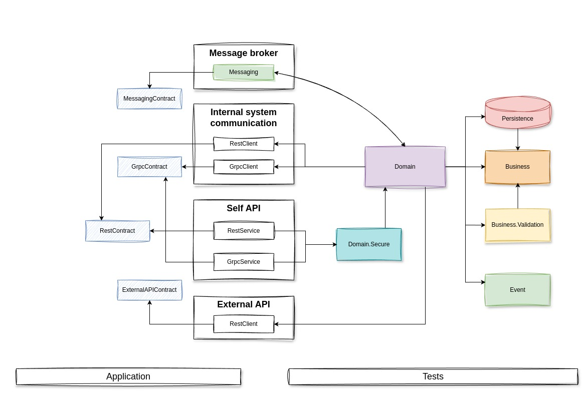

# FacilityAccessService

## Navigation list

1. [About](#about)
2. [Project structure](#structure)
   - [Project relationships](#schema_whole_project)
   - [Project descriptions](#project_descriptions)

## About
This service implements an access control system for objects within the enterprise premises. To operate, it is necessary to know when a new user is registered in the system, via a message broker, in order to create a local user based on their UID, with data specific to this service, such as determining the role of guest, employee, guard, or administrator. Additionally, a connection to a service that will authenticate the user's session, which is used across the entire system, is required.

## Project structure
In this section, each project within the solution is described, including its purpose and responsibilities.

### Project relationships

### Project descriptions

**Business**

This project is responsible for business rules. As a rule, it does not reference anything and serves as a cornerstone for the rest of the system. It contains business entities, repository interfaces, service interfaces, and interfaces for service integrations.

**Business.Validation**

In my solution, which may not be entirely correct, business entities do not contain an internal validation mechanism. Instead, I have extracted validation rules for various business models and actions into a separate layer. All these rules are implemented using *FluentValidation*.

**Event**

This project includes components that could have also been part of the business project. Essentially, it is still the same business layer as Business and Business.Validation, but separated into different projects for convenience. It contains interfaces for event publishing and processing, as well as business event models.

**Persistence**

This project is positioned beyond the business layer and pertains to the infrastructure. It references the business layer and implements repository interfaces through interaction with a specific database.
