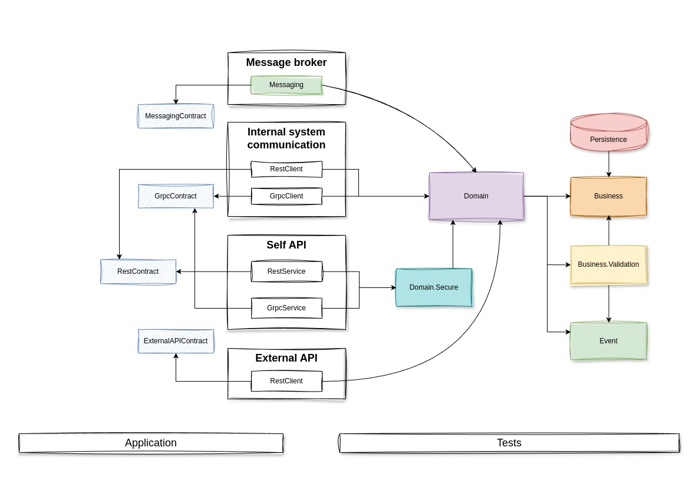

# FacilityAccessService

<a href="https://www.nuget.org/packages/AutoMapper/14.0.0"><a/>

## Navigation list

1. [About](#about)
2. [Project relationships](#project_relationships)
3. [Project structures](#project_structures)

## About

This service implements an access control system for objects within the enterprise premises.
To operate, it is necessary to know when a new user is registered in the system, via a message broker,
in order to create a local user based on their UID, with data specific to this service, such as determining the role of
guest, employee, guard, or administrator. Additionally, a connection to a service that will authenticate the user's
session, which is used across the entire system, is required.

## Project relationships

## Project structures

### Business

**Description:** This project is responsible for business rules.
As a rule, it does not reference anything and serves as a cornerstone for the rest of the system.
It contains business entities, repository interfaces, service interfaces, and interfaces for service integrations.

**References:** *none*.

**Packages:** *none*.

***

### Event

**Description:** This project includes components that could have also been part of the business project.
Essentially, it is still the same business layer as Business and Business.Validation, but separated into different
projects for convenience. It contains interfaces for event publishing and processing, as well as business event models.

**References:** *none*.

**Packages:** *none*.

***

### Business.Validation

**Description:** In my solution, which may not be entirely correct, business entities do not contain an internal
validation mechanism. Instead, I have extracted validation rules for various business models and actions into a separate
layer. All these rules are implemented using *FluentValidation*.

**References:** *Business, Event*.

**Packages:** *<a href="https://www.nuget.org/packages/FluentValidation/11.11.0">FluentValidation (11.11.0)</a>*.

***

### Domain

**Description:** The heart of the entire project.
It describes the implementation of business functionality, specifically the interfaces of services.
This layer also includes validation of service input data and validation of business entities.
Additionally, it publishes events according to business logic.
Simply put, it implements high-level logic, while the implementation of repository and the like interfaces used here is
moved to other projects and tightly coupled with a specific technologies.

**References:** *Business, Business.Validation, Event*.

**Packages:** none.

***

### Domain.Secure

**Description:** A special case. Since the domain only defines how business functions are executed, an access control
system for these functions needs to be implemented somewhere. In fact, this project serves as a wrapper around the
domain, providing access control for the use of service logic.

**References:** *Domain*.

**Packages:** *none*.

***

### Persistence

**Description:** This project is positioned beyond the business layer and pertains to the infrastructure.
It references the business layer and implements repository interfaces through interaction with a specific database.

**References:** *Business*.

**Packages:** *<a href="https://www.nuget.org/packages/Microsoft.EntityFrameworkCore/9.0.2">EntityFrameworkCore(9.0.2)</a>,
<a href="https://www.nuget.org/packages/AutoMapper/14.0.0">AutoMapper(14.0.0)<a/>*.

